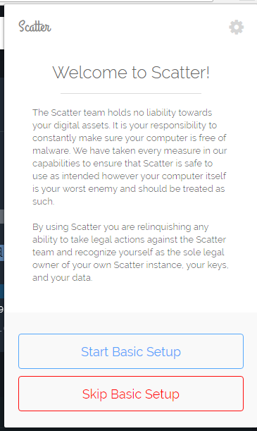
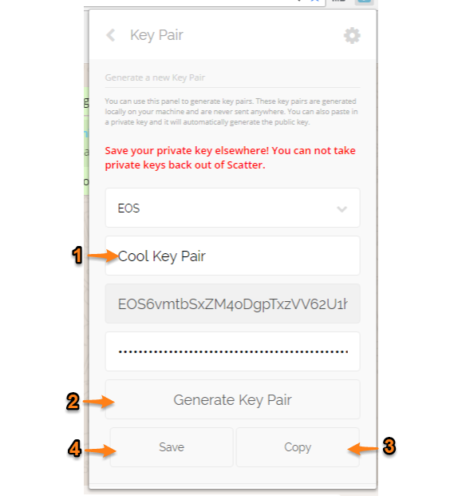

# Install and configure a wallet software

For a regular user to interact with EOS blockchain, it's interesting to use a wallet software. Doing
so, you can sign a transaction and publish it to the blockchain without exposing your private key.

On the other hand, you will have to trust your pk to the chosen wallet software and it's process of storing it. That's why hardware wallets do a lot of success with several other cyptocurrencies and at this point we all hope some project get a good hardware wallet compatible with EOS as soon as possible.

So, for this purpose, always use an auditable open source code software, and always check the origin of your download. 

For this tutorials, we chose to use [Scatter](https://github.com/EOSEssentials/Scatter), a browser extension that works with Google Chrome or Firefox.

# Installation

1. On a machine with Google Chrome installed, add Scatter extension from [chrome web store](https://chrome.google.com/webstore/detail/scatter/ammjpmhgckkpcamddpolhchgomcojkle)

2. Click on the new chrome toolbar icon  

3. Create and confirm a very strong password to protect the Scatter local data storage. Use **at least 12** lower and uppercase letters, numbers **and** special characters. Click on "Create New Scatter" button. This example uses a really long the password `xC4Km*zAn$as8!!v$fRHqcDxumW2u#QP`;

4. Scatter now creates a cryptographic seed and shows you a mnemonic phrase. Write it down carefully, **every one of the twelve words in the very same order** (line by line).  
  
These twelve words are (almost) randomly selected from a 2,048 english words list of the [BIP39 standard](https://en.bitcoin.it/wiki/Mnemonic_phrase). The BIP39 gives you the capacity to regenerate the cryptographic seed that Scatter have just created and will cover up you if you forget your password. BUT, different from wallets implementations on other blockchains, you **cannot** recover your entire Scatter just using the mnemonic phrase. In the case you loose Scatter data (ex.: a hard drive wipe or loosing your entire laptop), you will really need **a backup file** (wich we will cover soon) **AND one of the two: 1) your password OR 2) your mnemonic phrase**.  
If you create a new Scatter from zero with the same password, it will give you the same mnemonic. If you change your password, Scatter will change your mnemonic phrase.

# Backup and test

5. Now read Scatter disclaimer and then click in "**Skip Basic Setup**", as our objective is to create and test a backup file!  

6. At this point you really already know how important is to keep you private key **private**, so let's create our first key pair! As a matter of fact, you create only a random private key, as the
public key mathmatically generated from it.  
Differently from Bitcoin and other blockchains *[deterministic wallets](https://en.bitcoin.it/wiki/Deterministic_wallet)* Scatter will create a totally random private key that has nothing to do with your password or mnemonic phrase. So click
in the "Key Pairs" link, give a cool name to your new key pair and click in "Generate", in "Copy" (if you want to save your private key elsewhere) and then in "Save". In this example, scatter created:
`Private Key: 5K4PEv5RJcA7LtFaHCqZpajTQbasEXKWH8692RaQMCC1YxTBGtF` and `Public Key: EOS6vmtbSxZM4oDgpTxzVV62U1hHj1ZEyzhVJuvCMAzA8KZq6g3CA`  
