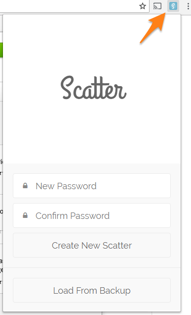
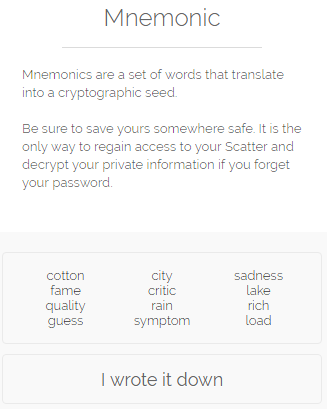

# Install and configure a wallet software

For a regular user to interact with EOS blockchain, it's interesting to use a wallet software. Doing
so, you can sign a transaction and publish it to the blockchain without exposing your private key.

On the other hand, you will have to trust your pk to the chosen wallet software and it's process of storing it. That's why hardware wallets do a lot of success with several other cyptocurrencies and at this point we all hope some project get a good hardware wallet compatible with EOS as soon as possible.

So, for this purpose, always use an auditable open source code software, and always check the origin of your download. 

For this tutorials, we chose to use [Scatter](https://github.com/EOSEssentials/Scatter), a browser extension that works with Google Chrome or Firefox.

# Steps

1. On a machine with Google Chrome installed, add Scatter extension from [chrome web store](https://chrome.google.com/webstore/detail/scatter/ammjpmhgckkpcamddpolhchgomcojkle)

2. Click on the new chrome toolbar icon  

3. Create and confirm a very strong password to protect the Scatter local data storage. Use **at least 12** lower and uppercase letters, numbers **and** special characters. Click on "Create New Scatter" button;

4. Write down securely the **12 words** that backup the new seed.  
  
These 12 words are (almost) randomly selected from a 2,048 english words list of the [BIP39 standard](https://en.bitcoin.it/wiki/Mnemonic_phrase). The BIP39 gives you the capacity to regenerate the cryptographic seed that Scatter have just created.  
This can be a life saving resource in the case you loose your password or if you loose the installation data (ex.: 
a hard drive wipe with no backup or loosing your entire laptop).  
If at this point you are wondering if just twelve words from a previously agreed list is really secure, just realize that the number of possible combinations for 12 words would be 2048^12 = 2^132. As the BIP39 phrase [is not truly random](https://github.com/bitcoin/bips/blob/master/bip-0039.mediawiki#Generating_the_mnemonic), we end getting 128-bit security or ~340,282,366,920,938,463,463,374,607,431,770,000,000 possible combinations. This is approximately the same security you get from a regular Bitcoin wallet. So, it really is **a lot** easier to find your wrote down seed words than to guess it, even using extremely powerful computers. **Store it securely!** 

5. Import the private key of your EOS account to Scatter.